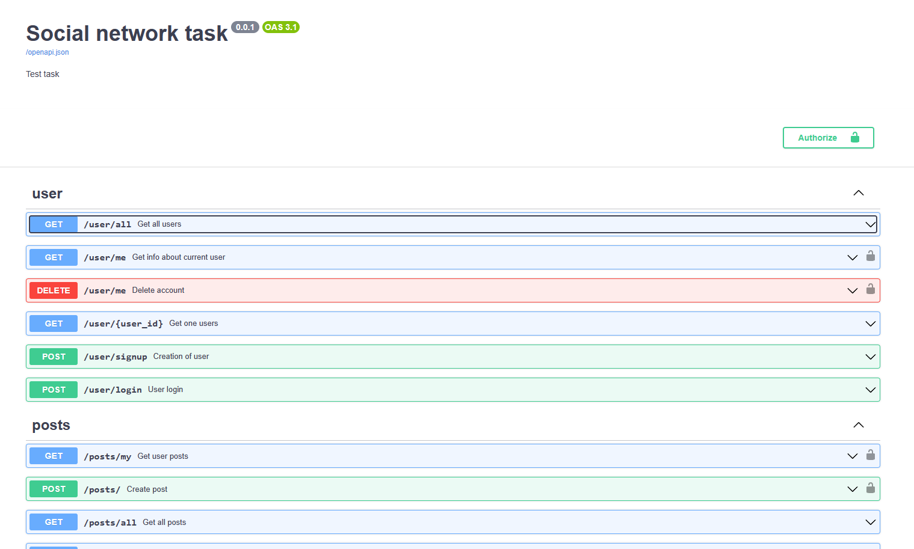
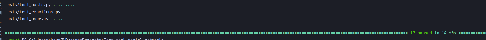

# About app
This is a simple social network app that allows users to login, sing up, post posts and leave reactions as likes and dislikes

## Deployment

The deployment is very simple since app is using Docker compose and Docker containers to run

You can run the app by running the following command
````
docker-compose up --build
````

Then you can assess the app on http://localhost:8000/docs



## Testing
To test the app you can run automated tests inside ``backend`` container with command
```
pytest .
```
Or from outer shell

```
docker exec -it backend pytest .
```
Or you can manually try application interface on http://localhost:8000/docs


